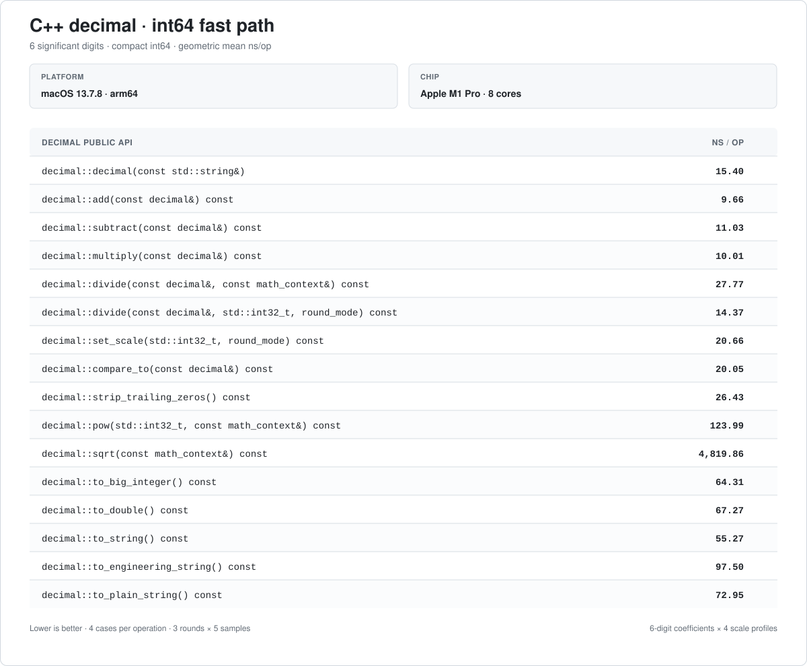

# decimal

English | [简体中文](README.zh-CN.md) | [Documentation](https://nepleo.github.io/decimal/) |
[HTML preview](https://htmlpreview.github.io/?https://github.com/nepleo/decimal/blob/main/docs/index.html)

[](https://github.com/nepleo/decimal/actions/workflows/ci.yml)
[](https://nepleo.github.io/decimal/)
[](LICENSE)
[](https://hits.sh/github.com/nepleo/decimal/)


decimal is a header-only C++17 library for exact, arbitrary-precision decimal arithmetic. It is designed for money,
rates, measurements, and other calculations where binary floating-point surprises are unacceptable.

```cpp
#include <decimal/decimal.h>

#include <iostream>

int main() {
  const decimal unit_price("19.99");
  const decimal quantity(3);
  const decimal total = unit_price.multiply(quantity).set_scale(2, round_mode::HALF_EVEN);

  std::cout << total.to_plain_string() << '\n';  // 59.97
}
```

## Why decimal?

Many decimal fractions cannot be represented exactly by binary floating-point types. This matters when values must
remain reproducible across parsing, calculation, storage, and display.

```cpp
const decimal exact("0.1");
const decimal from_binary(0.1);

exact.to_plain_string();        // 0.1
from_binary.to_plain_string();  // Exact decimal value of the binary double.
```

Use `decimal` when decimal input must remain exact, rounding rules are part of the domain, values can exceed fixed
integer ranges, or scale is meaningful. Use `double` when approximate binary floating-point arithmetic is expected
and its hardware-oriented performance is more important than decimal representation.

## Highlights

- Header-only and dependency-free.
- Arbitrary-precision decimal values backed by arbitrary-precision integers.
- Exact addition, subtraction, multiplication, comparison, and terminating division.
- Explicit scale and eight rounding modes, including `HALF_EVEN` and `UNNECESSARY`.
- Precision-controlled operations through `math_context`.
- Plain, engineering, and scientific string representations.
- Portable C++17 fallback plus optimized compiler intrinsics when available.
- Tested with GCC, Clang, AppleClang, MSVC, and clang-cl in CI.

## Choose the right input

| Input | Recommended API | Use it for |
| --- | --- | --- |
| Exact decimal text | `decimal("123.45")` | Money, rates, serialized values, user input |
| Integer value | `decimal(std::int64_t{42})` | Counts and already scaled integer-free values |
| Unscaled integer and scale | `decimal::value_of(12345, 2)` | Database values and fixed-point protocols |
| Canonical decimal form of a `double` | `decimal::value_of(0.1)` | Interoperating with an existing floating-point API |
| Exact value represented by a `double` | `decimal(0.1)` | Inspecting or preserving the binary floating-point value |

`scale` is the number of digits to the right of the decimal point. `math_context::precision()` limits significant
digits across an operation. For example, `set_scale(2, mode)` answers "keep two fractional digits", while
`math_context(6, mode)` answers "keep six significant digits".

## Installation

### Add the repository as a subdirectory

```cmake
add_subdirectory(path/to/decimal)

add_executable(my_app main.cc)
target_link_libraries(my_app PRIVATE decimal::decimal)
```

Tests and installation rules remain disabled when decimal is a subproject unless `DECIMAL_BUILD_TESTS` or
`DECIMAL_INSTALL` is explicitly enabled.

### Use an installed CMake package

```sh
cmake -S . -B build \
  -DDECIMAL_BUILD_TESTS=OFF \
  -DCMAKE_INSTALL_PREFIX=/path/to/decimal-install
cmake --build build
cmake --install build
```

```cmake
find_package(decimal 0.1 CONFIG REQUIRED)

add_executable(my_app main.cc)
target_link_libraries(my_app PRIVATE decimal::decimal)
```

Pass `-DCMAKE_PREFIX_PATH=/path/to/decimal-install` when the package is installed outside a standard prefix.

## Requirements and portability

- A C++17-compatible compiler.
- CMake 3.16 or later when using the CMake package or building the tests.

decimal detects capabilities instead of assuming a compiler family. GCC and Clang can use built-in bit, overflow,
and native 128-bit integer operations. MSVC and clang-cl use supported `<intrin.h>` operations. Other compilers and
architectures use dependency-free portable implementations.

Define `DECIMAL_DISABLE_INTRINSICS=1` before including the header to force the portable implementation when validating
a new compiler or target.

## Performance snapshot

This snapshot measures the compact `int64` fast path on macOS 13.7.8 with an Apple M1 Pro. Values are geometric mean
nanoseconds per operation, and lower is better. Results describe this environment rather than a cross-platform guarantee.

[](docs/benchmark.svg)

## Documentation

The [online manual](https://nepleo.github.io/decimal/) contains:

- A task-oriented introduction to value, scale, precision, and rounding.
- Detailed documentation for every application-facing `decimal` function family.
- Guidance for choosing division, conversion, and formatting overloads.
- Runnable examples for money, exchange rates, CSV input, loans, and exactness checks.
- Advanced references for `round_mode`, `math_context`, and `bigint`.

If the custom domain is temporarily unavailable, use the
[HTML preview](https://htmlpreview.github.io/?https://github.com/nepleo/decimal/blob/main/docs/index.html).

## Building and testing

```sh
cmake -S . -B build -DCMAKE_BUILD_TYPE=Release
cmake --build build --parallel
ctest --test-dir build --output-on-failure
```

For a multi-configuration generator, add `--config Release` when building and `-C Release` when running CTest.

| CMake option | Top-level default | Subproject default | Description |
| --- | --- | --- | --- |
| `DECIMAL_BUILD_TESTS` | `ON` | `OFF` | Build the test suite |
| `DECIMAL_INSTALL` | `ON` | `OFF` | Generate installation rules |

## License

decimal is available under the [MIT License](LICENSE).
